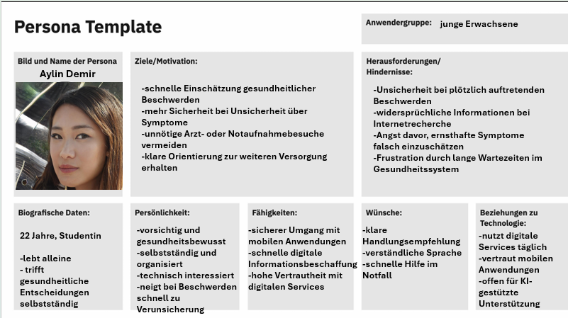
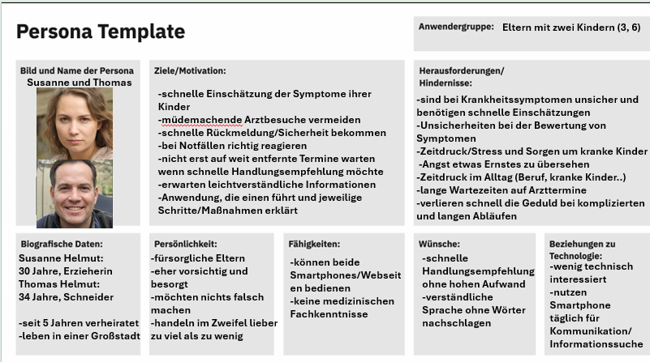

# KI-basierte Patientensteuerung

## 1. Einleitung

### 1.1 Ziel des Dokumentes

Das folgende Dokument beschreibt den Aufbau und die grundlegenden Funktionen der entwickelten Webanwendung zur KI-basierten Patientensteuerung.

Ziel ist es, einen Überblick über die Systemarchitektur, die zentralen Komponenten sowie die grundlegenden Funktionen der Anwendung zu geben. Darüber hinaus sollen technische Entscheidungen und Abläufe nachvollziehbar dokumentiert werden, um ein besseres Verständnis des Projekts für alle Beteiligten zu ermöglichen.

### 1.2 Projektbeschreibung

Das Projekt beschäftigt sich mit der Entwicklung einer Webanwendung zur KI-basierten Patientensteuerung und medizinischen Ersteinschätzung.

Ziel der Anwendung ist es, Nutzer bei der Einschätzung gesundheitlicher Beschwerden zu unterstützen und eine erste Orientierung zur weiteren Versorgung zu geben.

Die Anwendung ermöglicht die strukturierte Erfassung von Symptomen sowie eine KI gestützte Auswertung der Nutzereingaben. Zusätzlich sollen kritische Beschwerden frühzeitig erkannt und passende Handlungsempfehlungen ausgegeben werden.

### 1.3 Projektabgrenzung

Unsere Anwendung soll ausschließlich der unterstützenden Ersteinschätzung gesundheitlicher Beschwerden dienen und ersetzt keine professionelle medizinische Diagnose, Beratung oder Behandlung durch Fachpersonal.

Eine vollständige medizinische Bewertung kann durch das System nicht garantiert werden, da die Einschätzung auf Nutzereingaben basiert und KI gestützte Verfahren Fehler enthalten können.

### 1.4 Zielgruppe des Dokumentes

Das Dokument richtet sich an alle am Projekt beteiligten Personen und dient der Darstellung des Systemaufbaus und der zentralen Funktionen der Anwendung.

Dazu gehören insbesondere:

- das Entwicklungsteam zur technischen Orientierung und Umsetzung
- betreuende Professoren zur Bewertung des Projekts und des Entwicklungsfortschritts
- der Auftraggeber zur Nachvollziehbarkeit der Architektur und der geplanten Funktionen

---

# 2. Allgemeine Systembeschreibung

## 2.1 Produktidee

Die Webanwendung soll Nutzer bei der ersten Einschätzung gesundheitlicher Beschwerden unterstützen und eine schnelle Orientierung zur weiteren Versorgung bieten.

Symptome können dabei über ein interaktives Körpermodell, vordefinierte Kategorien sowie Freitextfelder erfasst werden.

Die angegebenen Informationen werden anschließend KI gestützt ausgewertet, wobei mögliche kritische Beschwerden (Red Flags) erkannt und passende Handlungsempfehlungen vorgeschlagen werden.

Die Nutzung soll ohne Registrierung möglich sein. Gespeicherte Daten können stattdessen über einen individuellen Zugriffscode wieder aufgerufen werden.

## 2.2 Hauptfunktionen

Die Anwendung bietet unter anderem folgende Hauptfunktionen:

- Erfassung von Basisdaten und gesundheitlichen Zusatzangaben
- Symptomerfassung über ein interaktives Körpermodell
- Auswahl und Kombination mehrerer Symptome
- KI gestützte Auswertung der Nutzereingaben
- Erkennung kritischer Beschwerden (Red Flags)
- Bestimmung einer Dringlichkeitsstufe
- Ausgabe von Handlungsempfehlungen und Versorgungsvorschlägen
- SOS Funktion mit Weiterleitung zum Notruf
- Speicherung und Verwaltung von Sitzungsdaten
- Barrierearme und intuitive Nutzung ohne Registrierung

## 2.3 Zielgruppe

Die Anwendung richtet sich insbesondere an Personen, die eine schnelle erste Orientierung bei gesundheitlichen Beschwerden benötigen und Unterstützung bei der Einschätzung der Dringlichkeit ihrer Situation suchen.

Sie soll dabei helfen, Beschwerden besser einzuordnen und in möglichen Notfallsituationen mehr Sicherheit bei der weiteren Entscheidung zu geben.

## 2.4 Personas

### Persona 1: Aylin Demir

Aylin Demir repräsentiert junge Erwachsene, die gesundheitliche Beschwerden zunächst eigenständig einschätzen möchten und dabei stark auf digitale Anwendungen zurückgreifen.

Durch ihre technologische Vertrautheit nutzt sie selbstverständlich Apps und Online Dienste, fühlt sich bei gesundheitlichen Symptomen jedoch schnell verunsichert.

Besonders bei plötzlich auftretenden Beschwerden besteht die Gefahr, dass Unsicherheiten durch Internetrecherchen verstärkt werden oder medizinische Situationen falsch eingeschätzt werden.

Die Persona verdeutlicht damit den Bedarf nach einer schnellen, verständlichen und niedrigschwelligen Orientierungshilfe im Gesundheitsbereich.

Gleichzeitig zeigt sie eine typische Zielgruppe unserer Anwendung, die digitale Unterstützung aktiv nutzt, um unnötige Arzt oder Notaufnahmebesuche zu vermeiden und dennoch Sicherheit bei gesundheitlichen Entscheidungen zu erhalten.

### Persona 2: Susanne und Thomas Helmut

Susanne und Thomas Helmut repräsentieren Eltern, die bei Krankheitssymptomen ihrer Kinder häufig unter Unsicherheit und Zeitdruck stehen.

Besonders in möglichen Notfallsituationen besteht die Sorge, ernsthafte Beschwerden zu spät zu erkennen oder falsch einzuschätzen.

Gleichzeitig wünschen sie sich verständliche Informationen und schnelle Handlungsempfehlungen, ohne lange Wartezeiten oder komplizierte Abläufe im Gesundheitssystem.

Die Persona zeigt insbesondere den Bedarf nach einer leicht verständlichen und strukturierten Benutzerführung.

Außerdem verdeutlicht sie, wie wichtig schnelle Orientierung und klare Kommunikation für Nutzer ohne medizinische Fachkenntnisse sind.

---

# 3. Systemarchitektur

## 3.1 Architekturübersicht und Komponentendiagramm

Das folgende Komponentendiagramm zeigt den Aufbau der Anwendung sowie die Kommunikation zwischen den einzelnen Systembestandteilen.

Die Architektur besteht aus einer Datenhaltungsschicht, einer Präsentations und Anwendungsschicht sowie einer KI Komponente.

Zusätzlich ist eine mögliche externe Schnittstelle über FHIR vorgesehen.

Die zentrale Anwendung basiert auf Next.js und verbindet Frontend, Backend, Datenbanken sowie die KI Komponente miteinander.

Nutzereingaben werden über das Frontend erfasst und an das Backend weitergeleitet.

Dort erfolgt die Verarbeitung der Daten sowie die Kommunikation mit den Datenbanken und der KI.

## 3.2 Erläuterung der Komponenten

### Frontend

Das Frontend dient als Benutzeroberfläche der Anwendung und ermöglicht die Eingabe sowie Darstellung gesundheitsbezogener Informationen.

Nutzer können Symptome erfassen, Fragen beantworten und Handlungsempfehlungen einsehen.

Die Umsetzung erfolgt innerhalb der Next.js Anwendung mithilfe einer React basierten Benutzeroberfläche.

### Backend

Das Backend verarbeitet die Nutzereingaben und übernimmt die Kommunikation zwischen Frontend, Datenbanken und KI Komponente.

Eingaben werden strukturiert verarbeitet und für die weitere Auswertung vorbereitet.

Die Verarbeitung erfolgt über API Routen innerhalb der Next.js Anwendung.

### Datenbank

Für die Speicherung und Verwaltung der Daten werden PostgreSQL Datenbanken verwendet.

Die `lemonlabs_db` dient der Speicherung von Nutzereingaben, Sitzungsdaten sowie generierten Ergebnissen.

### KI Komponente

Die KI Komponente basiert auf Ollama sowie dem Sprachmodell MedGemma.

Die Aufgabe der KI besteht darin, Nutzereingaben zu analysieren und strukturierte Handlungsempfehlungen zu erstellen.

Zusätzlich können Freitexteingaben verarbeitet und präzisiert werden.

### FHIR Schnittstelle

Die FHIR Schnittstelle soll eine mögliche Anbindung an externe medizinische Systeme ermöglichen und den standardisierten Austausch medizinischer Informationen unterstützen.

## 3.3 Verzeichnisstruktur

## 3.4 Verwendete Technologien

| Technologie | Einsatzbereich | Vorteil |
|------------|------------|------------|
| Next.js 16.2.4 | Umsetzung von Frontend und Backend | Zentrale Verwaltung von Benutzeroberfläche, Serverlogik und API Routen |
| React 19.2.4 | Benutzeroberfläche im Frontend | Komponentenbasierte und interaktive Darstellung |
| TypeScript | Entwicklung der Anwendung | Bessere Strukturierung und Typisierung des Codes |
| PostgreSQL 8.20.0 | Speicherung der Nutzerdaten | Strukturierte relationale Datenhaltung |
| Ollama 0.6.3 | Lokale Ausführung des KI Modells | Kompatibel mit MedGemma |
| MedGemma 27b | Verarbeitung medizinischer Nutzereingaben | Medizinisch optimiertes Sprachmodell |
| FHIR | Externe Schnittstelle | Standardisierter Austausch medizinischer Daten |

## 3.5 Datenfluss und Kommunikation

Die Kommunikation zwischen den einzelnen Systemkomponenten erfolgt über standardisierte Schnittstellen und Netzwerkprotokolle.

Dabei übernimmt die Next.js Anwendung die zentrale Vermittlung zwischen Frontend, Datenbanken, KI Komponente sowie möglichen externen Systemen.

| Verbindung | Kommunikationsform |
|------------|------------|
| Next.js ↔ lemonlabs_db | TCP/IP (SQL) |
| Next.js ↔ Ollama | HTTP/REST (JSON) |
| Next.js ↔ externe Systeme | HTTP/REST (FHIR) |

Die Verarbeitung der Nutzereingaben erfolgt schrittweise innerhalb der Systemarchitektur.

Nach der Eingabe über das Frontend werden die Daten im Backend verarbeitet, an die KI Komponente weitergeleitet und anschließend als Handlungsempfehlung an die Benutzeroberfläche zurückgegeben.

Zusätzlich können relevante Informationen in den Datenbanken gespeichert und erneut abgerufen werden.  

# 4. Benutzeroberfläche und Ablauf

## 4.1 Benutzerfluss

Zur Veranschaulichung des Benutzerflusses durch unsere Webanwendung dient das folgende Aktivitätsdiagramm.

Es zeigt den grundlegenden Ablauf der Anwendung von der Eingabe der Beschwerden bis zur Ausgabe einer Handlungsempfehlung.

Nutzer werden dabei schrittweise durch die Symptomerfassung geführt und können zusätzliche Angaben ergänzen oder Eingaben bearbeiten.

## 4.2 Interaktives Körpermodell

Das interaktive Körpermodell dient der visuellen Symptomerfassung und soll Nutzern die Zuordnung gesundheitlicher Beschwerden erleichtern.

Verschiedene Körperregionen können direkt ausgewählt werden, wodurch passende Symptomkategorien angezeigt werden.

Die Auswahl einzelner Körperbereiche wird visuell hervorgehoben und kann bei Bedarf wieder entfernt oder angepasst werden.

Ziel des Körpermodells ist eine möglichst intuitive und verständliche Eingabe gesundheitlicher Informationen, insbesondere für Nutzer ohne medizinische Fachkenntnisse.

## 4.3 Benutzerfreundlichkeit und UX

Bei der Gestaltung der Anwendung wird besonderer Wert auf Benutzerfreundlichkeit und barrierearme Nutzung gelegt.

Die Navigation soll möglichst selbsterklärend aufgebaut sein, damit die Anwendung ohne lange Einarbeitung genutzt werden kann.

Die folgenden Anforderungen basieren auf den funktionalen und nichtfunktionalen Anforderungen des Product Backlogs.

| ID | UX-/Barrierefreiheitsaspekt | Umsetzung |
|----|----|----|
| NFA 001 | Intuitive Bedienbarkeit | Einfache Navigation und klare Benutzerführung ohne lange Einarbeitung |
| NFA 002 | Verständliche Sprache | Verwendung einfacher und verständlicher Formulierungen anstelle komplexer medizinischer Fachbegriffe |
| NFA 003 | Ladezeiten | Schnelle Reaktionszeiten und kurze Ladezeiten |
| NFA 004 | Visuelle Barrierefreiheit | Kontrastreiche Darstellung, gut lesbare Texte und Unterstützung von Screenreadern |
| NFA 005 | Barrierearme Bedienbarkeit | Große klickbare Elemente sowie einfache Bedienung mit Maus und Tastatur |
| NFA 006 | Responsives Design | Optimierte Darstellung auf mobilen Geräten, Tablets und Desktop PCs |
| NFA 007 | Ansprechende Benutzeroberfläche | Klare Struktur, konsistentes Design und erkennbare visuelle Hierarchien |
| NFA 008 | Unterstützung durch Icons | Wichtige Funktionen werden zusätzlich durch verständliche Icons unterstützt |
| FA 039 | Navigation zwischen Schritten | Vor und Zurücknavigation innerhalb der Symptomerfassung möglich |
| FA 049 | Hilfefunktion bzw. Bedienungsanleitung | Auf jeder Seite befindet sich ein Hilfe Button mit Erklärungen zur aktuellen Ansicht |

## 4.4 Zusätzliche Funktionen der Anwendung

| Epic | Funktion | Beschreibung | Product Backlog |
|--------|--------|--------|--------|
| Datenhaltung | Daten abrufen | Gespeicherte Beschwerden und Einschätzungen können über Zugriffscode eingesehen werden | FA 030 |
| Datenhaltung | Daten löschen | Nutzer können Daten eigenständig löschen | FA 031 |
| Datenhaltung | Automatische Datenlöschung | Daten werden nach sieben Tagen gelöscht | FA 032 |
| Datenhaltung | Datenexport | Ergebnisse der Einschätzung können exportiert werden | FA 033 |
| UX | Vor und Zurücknavigation | Nutzer können zwischen einzelnen Schritten wechseln | FA 039 |
| UX | Terminweiterleitung | Weiterleitung zu externen Terminservices möglich | FA 041, FA 042 |
| UX | Rezeptweiterleitung | Weiterleitung zu externen Rezeptdiensten möglich | FA 043, FA 044 |
| UX | Support | Kontaktmöglichkeiten für Probleme vorhanden | FA 045 |
| UX | Nutzung ohne Registrierung | Die Anwendung kann ohne Benutzerkonto verwendet werden | FA 048 |
| UX | Bedienungsanleitung | Jede Seite enthält einen Hilfe Button mit Erklärungen | FA 049 |
| UX | Offline Modus | Eingeschränkte Nutzung ist ohne Internetverbindung möglich | FA 050 |
| UX | Installierbarkeit | Anwendung kann installiert werden | FA 051 |
| UX | Offline Anleitung | Bedienungsanleitungen sind offline verfügbar | FA 053 |
| Transparenz | Datenschutzerklärung | Datenschutzhinweise sind innerhalb der Anwendung abrufbar | FA 046 |
| Transparenz | Impressum | Informationen zu Verantwortlichen der Anwendung sind verfügbar | FA 047 |

---

# 5. KI- und Entscheidungslogik

## 5.1 Nutzereingaben

Die Erfassung der Basisdaten bildet die Grundlage der medizinischen Ersteinschätzung innerhalb der Anwendung.

Zu Beginn können Nutzer Angaben wie Alter und Geschlecht machen.

Abhängig vom Geschlecht können zusätzlich Angaben zu Schwangerschaft oder Stillzeit erfasst werden.

Darüber hinaus können weitere Informationen wie Medikamenteneinnahme, Allergien, Vorerkrankungen oder Drogenkonsum optional ergänzt werden.

Diese Zusatzangaben sind überspringbar, um Nutzer insbesondere in möglichen Notfallsituationen nicht unnötig aufzuhalten und eine schnelle Einschätzung zu ermöglichen.

Anschließend erfolgt die eigentliche Symptomerfassung.

Nutzer können Beschwerden über verschiedene Eingabemöglichkeiten angeben.

Im Vordergrund steht das interaktive Körpermodell.

Zusätzlich stehen vordefinierte Symptomkategorien sowie Freitextfelder zur Verfügung.

Mehrere Symptome können gleichzeitig erfasst und bei Bedarf bearbeitet oder entfernt werden.

Ziel der Symptomerfassung ist eine möglichst strukturierte und verständliche Erfassung gesundheitlicher Beschwerden als Grundlage für die weitere KI gestützte Auswertung.

## 5.2 Red Flags und Dringlichkeitseinstufung

Kritische Symptome beziehungsweise Kombinationen aus Symptomen und anderen Angaben (Red Flags) sollen innerhalb der Anwendung frühzeitig erkannt werden.

Dazu gehören Beschwerden, die auf mögliche Notfallsituationen hinweisen können und eine schnelle medizinische Versorgung erfordern.

Bereits im ersten Schritt der Anwendung vor Beginn der eigentlichen Symptomerfassung werden Nutzer auf mögliche Red Flags hingewiesen.

Zusätzlich überprüft das System die eingegebenen Beschwerden während der Verarbeitung auf kritische Symptome oder gefährliche Kombinationen von Angaben.

Wird eine mögliche Notfallsituation erkannt, erfolgt die automatische Zuweisung einer hohen Dringlichkeitsstufe.

Zusätzlich wird sofort ein deutlich sichtbarer Warnhinweis angezeigt, welcher klare Handlungsempfehlungen enthält und zur Nutzung des SOS Buttons auffordert.

Über den SOS Button kann die Telefonanwendung des Geräts geöffnet werden.

Dabei wird die Notrufnummer 112 bereits gewählt, sodass nur noch ein Klick nötig ist und der Anruf schnell gestartet werden kann.

Die Dringlichkeitseinstufung ist eine Einschätzung der gesundheitlichen Beschwerden.

Ziel ist es, den Nutzern eine erste Orientierung zur weiteren Versorgung zu geben und kritische Situationen frühzeitig zu erkennen.

## 5.3 Verarbeitung der Eingaben

Nach der Eingabe der Beschwerden werden die angegebenen Informationen im Backend verarbeitet und strukturiert zusammengeführt.

Dabei werden Basisdaten, ausgewählte Symptome, Freitexteingaben sowie zusätzliche Angaben gemeinsam ausgewertet.

Zusätzlich können Freitexteingaben genutzt werden, um Beschwerden zu ergänzen, die über das Körpermodell oder die vorhandenen Symptomkategorien nicht ausreichend erfasst werden können.

Der Schwerpunkt der Symptomerfassung liegt jedoch auf strukturierten Eingaben, da diese eine eindeutigere Verarbeitung der Informationen ermöglichen.

Die gesammelten Nutzereingaben werden anschließend an die KI Komponente weitergeleitet.

Diese wertet die Informationen aus und verwendet sie zur Erstellung einer medizinischen Ersteinschätzung sowie passender Handlungsempfehlungen.

## 5.4 Handlungsempfehlungen und Dringlichkeitsstufen

Auf Grundlage der eingegebenen Informationen sowie der KI gestützten Verarbeitung erstellt das System eine medizinische Ersteinschätzung.

Diese dient einer ersten Orientierung zur möglichen weiteren Versorgung und ist keine medizinische Diagnose.

Die KI generiert passende Handlungsempfehlungen für den Nutzer.

Diese sollen dabei unterstützen, die Situation besser einzuordnen und mögliche nächste Schritte verständlich darzustellen.

Zusätzlich erfolgt eine Einordnung in eine Dringlichkeitsstufe, um die medizinische Situation besser einschätzen zu können.

Die Anwendung verwendet folgende Dringlichkeitsstufen:

1. Beobachtung der Beschwerden
2. Arztbesuch erforderlich
3. Zeitnahe medizinische Abklärung erforderlich
4. Möglicher medizinischer Notfall
5. Akuter Notfall

Die Einschätzung basiert auf einem internen Symptom und Red Flag Katalog, welcher Symptome, mögliche Risiken sowie passende Versorgungsempfehlungen strukturiert abbildet.

Die KI nutzt diese Informationen unterstützend zur Erstellung einer verständlichen Auswertung.

## 5.5 Umgang mit KI Halluzinationen

Da die Anwendung auf einem KI Modell basiert, können fehlerhafte, unvollständige oder ungenaue Ausgaben nicht vollständig ausgeschlossen werden.

Aus diesem Grund wird versucht, die Nutzereingaben möglichst strukturiert und kontrolliert zu erfassen.

Zur Reduzierung möglicher Fehlinterpretationen und KI Halluzinationen werden unter anderem folgende Maßnahmen eingesetzt:

- Nutzung eines interaktiven Körpermodells zur strukturierten Symptomerfassung
- Verwendung vordefinierter Symptomkategorien anstelle eines freien KI Chats
- Begrenzung der Länge von Freitexteingaben
- Berücksichtigung kritischer Symptome (Red Flags) unabhängig von der KI
- Hinweise auf die Grenzen und Unsicherheiten der KI basierten Auswertung

In unserer Anwendung wird darauf hingewiesen, dass es sich ausschließlich um eine unterstützende medizinische Ersteinschätzung handelt und keine professionelle Diagnose oder Behandlung ersetzt.  

## 5.6 Missbrauch der Anwendung

Ein vollständiger Schutz vor absichtlich falschen oder missbräuchlichen Eingaben kann innerhalb der Anwendung nicht garantiert werden.

Dennoch soll die Benutzerführung potenziellen Missbrauch erschweren und unrealistische Eingaben reduzieren.

Im Gegensatz zu KI Chatanwendungen basiert die Symptomerfassung überwiegend auf strukturierten Auswahlmöglichkeiten.

Nutzer werden schrittweise durch die Eingabe geführt und geben Beschwerden hauptsächlich über das interaktive Körpermodell sowie vordefinierte Symptomkategorien an.

Freitexteingaben dienen lediglich als ergänzende Zusatzfunktion für Beschwerden, die nicht ausreichend durch vorhandene Kategorien beschrieben werden können.

Zusätzlich sind Freitexteingaben in ihrer Länge begrenzt.

Durch diese Gestaltung soll verhindert werden, dass die Anwendung überwiegend mit unstrukturierten oder offensichtlich unrealistischen Eingaben verwendet wird.

---

# 6. Datenschutz und Sicherheit

## 6.1 Datenschutz und Umgang mit Nutzerdaten

Die Anwendung verarbeitet gesundheitsbezogene Nutzereingaben und berücksichtigt daher grundlegende Datenschutzmaßnahmen.

Zur Umsetzung dieser Maßnahmen werden folgende Funktionen innerhalb der Anwendung bereitgestellt:

| Bereich | Umsetzung in der Anwendung | Product Backlog |
|----------|----------|----------|
| Nutzung ohne Registrierung | Die Anwendung kann ohne Benutzerkonto oder Login verwendet werden | FA 048 |
| Transparenz für Nutzer | Hinweise zu Grenzen der Anwendung und KI Unsicherheiten werden vor Beginn angezeigt | FA 027 |
| Datenschutzerklärung | Datenschutzerklärung ist innerhalb der Anwendung abrufbar | FA 046 |
| Speicherung von Sitzungsdaten | Nutzerdaten werden über einen Zugriffscode gespeichert und erneut abrufbar gemacht | FA 029, FA 030 |
| Datenlöschung | Nutzer können gespeicherte Daten löschen | FA 031 |
| Automatische Löschung | Daten werden nach sieben Tagen automatisch entfernt | FA 032 |
| Optionale Zusatzangaben | Sensible Zusatzangaben können übersprungen werden | FA 013, FA 014 |
| Datensparsamkeit | Es werden nur für die Ersteinschätzung relevante Informationen verarbeitet | FA 001, FA 013 |

## 6.2 Sicherheitsmaßnahmen

Zur Verbesserung von Sicherheit und Datenschutz werden verschiedene technische und organisatorische Maßnahmen berücksichtigt.

Dazu gehören folgende Maßnahmen:

| Sicherheitsaspekt | Umsetzung in der Anwendung |
|----------|----------|
| Eingabevalidierung | Eingaben werden auf realistische Werte überprüft |
| Strukturierte Symptomerfassung | Nutzung von Körpermodell und Symptomkategorien statt freiem KI Chat |
| Begrenzung von Freitext | Freitexteingaben sind ergänzend möglich und in ihrer Länge begrenzt |
| Red Flag Erkennung | Kritische Symptome werden unabhängig von der KI erkannt |
| Zugriffscode System | Gespeicherte Daten werden über individuelle Zugriffscodes verwaltet |

## 6.3 Systemgrenzen

Die Anwendung dient ausschließlich der unterstützenden medizinischen Ersteinschätzung und ersetzt keine professionelle Diagnose oder Behandlung.

Trotz strukturierter Eingaben und KI gestützter Verarbeitung können fehlerhafte oder unvollständige Einschätzungen nicht vollständig ausgeschlossen werden.

Die Qualität der Ergebnisse hängt außerdem von der Vollständigkeit und Richtigkeit der Nutzereingaben ab.

---

# 7. Qualitätssicherung

## 7.1 Testkonzept

Zur Sicherstellung der Funktionsfähigkeit und Stabilität der Anwendung werden verschiedene Testverfahren eingesetzt.

Dabei werden sowohl einzelne Komponenten als auch vollständige Benutzerabläufe überprüft.

| Testbereich | Testverfahren | Ziel | Verwendete Technologien |
|------------|------------|------------|------------|
| Frontend | End to End Tests, Unit Tests | Überprüfung vollständiger Benutzerabläufe von der Symptomerfassung bis zur Ausgabe der Handlungsempfehlung | Playwright, Jest |
| Backend | Unit Tests | Überprüfung einzelner Server Actions und Verarbeitungslogik | Jest |
| Benutzerfreundlichkeit | UX Fragebogen | Bewertung der Bedienbarkeit und Nutzerzufriedenheit durch Testpersonen | Google Forms |

## 7.2 Fehlermeldungen und Fehlerbehandlungen

Zur Verbesserung der Stabilität und Benutzerfreundlichkeit werden Fehler innerhalb der Anwendung sowohl im Frontend als auch im Backend behandelt.

Die Fehlerbehandlung erfolgt mithilfe von Try Catch Blöcken innerhalb der Anwendung.

Dadurch können auftretende Fehler kontrolliert abgefangen und verarbeitet werden.

Im Frontend werden Nutzern verständliche Fehlermeldungen oder Erfolgshinweise angezeigt, um Probleme nachvollziehbar darzustellen und eine klare Benutzerführung sicherzustellen.

Im Backend werden auftretende Fehler protokolliert und in der Konsole ausgegeben.

Dadurch können technische Probleme während der Entwicklung und Wartung schneller erkannt werden.

Mögliche Fehlerfälle innerhalb der Anwendung sind beispielsweise:

- ungültige oder unvollständige Eingaben
- fehlende Pflichtangaben
- Fehler bei der Kommunikation mit Datenbanken
- Verbindungsprobleme zur KI Komponente
- unerwartete Serverfehler

## 7.3 Qualitätsanforderungen

Neben der funktionalen Umsetzung werden auch verschiedene Qualitätsanforderungen berücksichtigt, um eine stabile und benutzerfreundliche Anwendung bereitzustellen.

| Qualitätsaspekt | Umsetzung in der Anwendung | Product Backlog |
|----------|----------|----------|
| Intuitive Bedienbarkeit | Klare Navigation und strukturierte Benutzerführung | NFA 001 |
| Verständliche Sprache | Einfache Formulierungen anstelle komplexer medizinischer Fachbegriffe | NFA 002 |
| Kurze Ladezeiten | Optimierte Verarbeitung und schnelle Reaktionszeiten | NFA 003 |
| Visuelle Barrierefreiheit | Kontrastreiche Darstellung und gut lesbare Inhalte, Schriftgrößenanpassung | NFA 004 |
| Barrierearme Bedienung | Große klickbare Elemente sowie Tastaturbedienung | NFA 005 |
| Responsives Design | Darstellung auf Smartphone, Tablet und Desktop PC | NFA 006 |
| Unterstützung durch Icons | Wichtige Funktionen werden zusätzlich visuell unterstützt | NFA 008 |

Die Qualitätsanforderungen dienen insbesondere der Verbesserung von Benutzerfreundlichkeit und Zugänglichkeit der Anwendung.

---

# 8. Fazit

## 8.1 Zusammenfassung

Im Rahmen des Projekts wurde eine Webanwendung zur KI basierten Patientensteuerung und medizinischen Ersteinschätzung entwickelt.

Ziel der Anwendung ist es, Nutzer bei gesundheitlichen Beschwerden zu unterstützen und eine erste Orientierung zur weiteren Versorgung zu geben.

Die Anwendung kombiniert strukturierte Symptomerfassung, ein interaktives Körpermodell sowie eine KI gestützte Auswertung zur Erstellung von Handlungsempfehlungen und Dringlichkeitseinschätzungen.

Zusätzlich werden kritische Symptome frühzeitig erkannt, um mögliche Notfallsituationen hervorzuheben.

Neben der Ersteinschätzung wurden außerdem Funktionen zu Datenschutz, Benutzerfreundlichkeit und Barrierefreiheit berücksichtigt.

Die Anwendung soll eine einfache, schnelle und verständliche Unterstützung im Gesundheitsbereich bieten, ersetzt jedoch keine professionelle medizinische Diagnose oder Behandlung.
